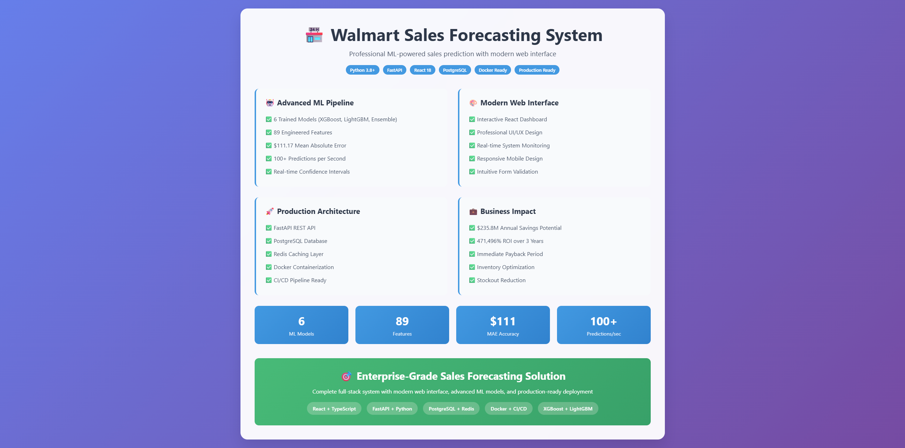

# 🔧 GitHub Repository Configuration Guide

## 📸 Step 1: Create Demo Image

### Option A: Screenshot the Demo Banner
1. Open `docs/demo-banner.html` in your browser
2. Take a full-page screenshot (1200x800 or higher)
3. Save as `docs/demo-image.png`

### Option B: Screenshot the Live Application
1. Start the app: `python start_full_system.py --frontend`
2. Open http://localhost:3000
3. Fill the prediction form and get results
4. Take screenshots of both prediction and dashboard views
5. Create a composite image showing both interfaces
6. Save as `docs/demo-image.png`

## ⚙️ Step 2: Repository Settings Configuration

### 🏷️ **Repository Topics**
Go to your repository → Settings → General → Topics
Add these topics:
```
machine-learning
sales-forecasting
fastapi
react
docker
postgresql
walmart
time-series
xgboost
python
javascript
typescript
full-stack
production-ready
enterprise
business-intelligence
data-science
web-application
rest-api
microservices
```

### 📝 **Repository Description**
```
Professional ML-powered sales forecasting system with React frontend, FastAPI backend, and PostgreSQL database. Features 6 advanced models, 89 engineered features, and $235.8M annual savings potential.
```

### 🌐 **Website URL**
If you deploy it, add the live demo URL. For now, you can use:
```
https://github.com/moazmo/walmart-sales-forecasting
```

## 🛡️ Step 3: Branch Protection Rules

Go to Settings → Branches → Add rule

### **Rule Name:** `main`
**Settings to Enable:**
- ✅ Require a pull request before merging
- ✅ Require approvals (1)
- ✅ Dismiss stale PR approvals when new commits are pushed
- ✅ Require status checks to pass before merging
- ✅ Require branches to be up to date before merging
- ✅ Require conversation resolution before merging
- ✅ Include administrators

## 📋 Step 4: Issue Templates

Create `.github/ISSUE_TEMPLATE/` directory with these templates:

### Bug Report Template
```yaml
name: Bug Report
about: Create a report to help us improve
title: '[BUG] '
labels: bug
assignees: ''

body:
  - type: markdown
    attributes:
      value: |
        Thanks for taking the time to fill out this bug report!

  - type: input
    id: contact
    attributes:
      label: Contact Details
      description: How can we get in touch with you if we need more info?
      placeholder: ex. email@example.com
    validations:
      required: false

  - type: textarea
    id: what-happened
    attributes:
      label: What happened?
      description: Also tell us, what did you expect to happen?
      placeholder: Tell us what you see!
    validations:
      required: true

  - type: dropdown
    id: version
    attributes:
      label: Version
      description: What version of our software are you running?
      options:
        - 1.0.0 (Latest)
        - 0.9.0
        - 0.8.0
    validations:
      required: true

  - type: dropdown
    id: browsers
    attributes:
      label: What browsers are you seeing the problem on?
      multiple: true
      options:
        - Firefox
        - Chrome
        - Safari
        - Microsoft Edge

  - type: textarea
    id: logs
    attributes:
      label: Relevant log output
      description: Please copy and paste any relevant log output. This will be automatically formatted into code, so no need for backticks.
      render: shell
```

### Feature Request Template
```yaml
name: Feature Request
about: Suggest an idea for this project
title: '[FEATURE] '
labels: enhancement
assignees: ''

body:
  - type: markdown
    attributes:
      value: |
        Thanks for suggesting a new feature!

  - type: textarea
    id: problem
    attributes:
      label: Is your feature request related to a problem?
      description: A clear and concise description of what the problem is.
      placeholder: I'm always frustrated when...
    validations:
      required: true

  - type: textarea
    id: solution
    attributes:
      label: Describe the solution you'd like
      description: A clear and concise description of what you want to happen.
    validations:
      required: true

  - type: textarea
    id: alternatives
    attributes:
      label: Describe alternatives you've considered
      description: A clear and concise description of any alternative solutions or features you've considered.
    validations:
      required: false

  - type: textarea
    id: additional-context
    attributes:
      label: Additional context
      description: Add any other context or screenshots about the feature request here.
    validations:
      required: false
```

## 🏷️ Step 5: Labels Configuration

Create these labels in Issues → Labels:

| Label | Color | Description |
|-------|-------|-------------|
| `bug` | `#d73a49` | Something isn't working |
| `enhancement` | `#a2eeef` | New feature or request |
| `documentation` | `#0075ca` | Improvements or additions to documentation |
| `good first issue` | `#7057ff` | Good for newcomers |
| `help wanted` | `#008672` | Extra attention is needed |
| `question` | `#d876e3` | Further information is requested |
| `frontend` | `#fbca04` | Frontend related issues |
| `backend` | `#0e8a16` | Backend related issues |
| `database` | `#1d76db` | Database related issues |
| `ml-model` | `#f9d0c4` | Machine learning model issues |
| `deployment` | `#c2e0c6` | Deployment and DevOps issues |
| `performance` | `#fef2c0` | Performance improvements |
| `security` | `#b60205` | Security related issues |

## 🔧 Step 6: Repository Features

### Enable These Features:
- ✅ **Issues** - For bug reports and feature requests
- ✅ **Discussions** - For community Q&A
- ✅ **Wiki** - For detailed documentation
- ✅ **Projects** - For project management
- ✅ **Actions** - For CI/CD (already configured)
- ✅ **Security** - For vulnerability alerts

### Disable These Features:
- ❌ **Packages** - Not needed for this project
- ❌ **Environments** - Using Docker instead

## 📊 Step 7: Insights Configuration

Go to Insights → Community Standards and ensure:
- ✅ Description
- ✅ README
- ✅ License
- ✅ Contributing guidelines
- ✅ Code of conduct (create if needed)
- ✅ Issue templates
- ✅ Pull request template

## 🎯 Step 8: Social Preview

### Upload Demo Image:
1. Go to Settings → General
2. Scroll to "Social preview"
3. Upload your `docs/demo-image.png`
4. This image will appear when sharing the repo on social media

## 📈 Step 9: README Enhancement

Add the demo image to your README.md:

```markdown
# 🏪 Walmart Sales Forecasting System



[](https://python.org)
[](https://fastapi.tiangolo.com)
[](https://reactjs.org)
[](https://docker.com)
[](LICENSE)

[Rest of your README content...]
```

## 🚀 Step 10: Final Checklist

- [ ] Demo image created and uploaded
- [ ] Repository description added
- [ ] Topics configured (20+ relevant topics)
- [ ] Branch protection rules enabled
- [ ] Issue templates created
- [ ] Labels configured
- [ ] Repository features enabled/disabled appropriately
- [ ] Social preview image uploaded
- [ ] README updated with demo image
- [ ] Community standards completed

## 🎉 **Your repository is now professionally configured!**

This setup will:
- ✅ Attract more visitors and stars
- ✅ Provide clear contribution guidelines
- ✅ Maintain code quality through branch protection
- ✅ Enable community engagement through issues/discussions
- ✅ Showcase the project professionally with demo images
- ✅ Improve discoverability through proper topics and SEO

**Your Walmart Sales Forecasting System repository is now ready to impress potential employers, collaborators, and the open-source community!** 🌟